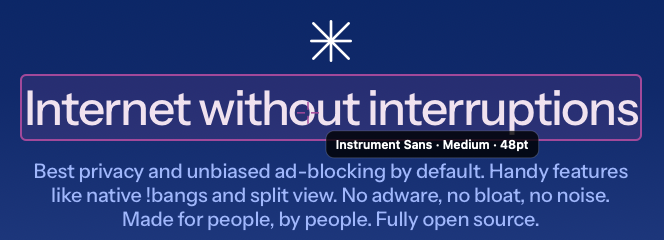

<div align="center">

# Picker

**A native macOS menu-bar color *and font* picker with Liquid Glass.**

Grab any pixel on screen as HEX / RGB / HSL — or click any text in any app to grab its font — and keep a palette and a font list of everything you've sampled.


<br>


&nbsp;&nbsp;


<br><br>



<sub><i>Grab Font reading a heading straight off a web page — family, weight, and size.</i></sub>

</div>

---

## What it does

Picker lives in your menu bar. Click it and you get two tools behind one glass panel:

- **Colors** — hit **Pick a Color** and your cursor becomes a magnified loupe. Line up the exact pixel anywhere on screen and click; the color drops in as HEX / RGB / HSL, ready to copy and saved to your palette.
- **Fonts** — hit **Grab Font** and your cursor becomes a text picker. Hover any text in **Safari**, another app, or a dropdown — a crosshair highlights the exact run and shows its family and size — then click to keep it. A live specimen, a "find this font" link, and a saved-fonts strip round it out.

A sliding pill switches between the two; nothing else moves.

## Features

- **Magnified-pixel sampling** — the native loupe magnifies the screen pixel-by-pixel, so you grab the exact one every time.
- **Grab any font, anywhere** — a click-through overlay reads the text *under* your cursor through the accessibility tree, so it works on web pages (Safari/WebKit), native apps, and even items in an already-open dropdown — highlighting the actual text run, never a surrounding box.
- **Liquid Glass** — a real macOS 26 glass panel, not a mockup.
- **HEX · RGB · HSL** — every color format at once; click a value to copy it and the icon flips to a checkmark.
- **Live font specimen** — every grabbed font renders in its own typeface, with a **Find** link that opens its Google Fonts page in Safari.
- **Saved palette & font list** — running strips of everything you've grabbed. Click to copy, hover to delete, scroll the row with your mouse wheel.
- **Readable on any color** — the text ink switches between black and white by perceived brightness, so the hex stays legible on reds, blues, and dark tones where naive luminance gets it wrong.
- **Out of the way** — no dock icon, no window clutter, one menu-bar click away.
- **Zero dependencies** — a single Swift package.

## Requirements

- macOS 26 (Tahoe) or later — Liquid Glass and the loupe need the macOS 26 SDK
- Xcode 26 / Swift 6.2 to build
- **Grab Font** needs Accessibility permission (macOS prompts on first use)

## Build & run

```bash
git clone https://github.com/Entrepenulian/Picker.git
cd Picker
./build.sh            # compiles and assembles build/Picker.app
open build/Picker.app # launches the menu-bar agent
```

An eyedropper appears in your menu bar:

- **Left-click** it to open the panel.
- **Right-click** it to quit.

To make it Spotlight-launchable, drag `build/Picker.app` into `/Applications`.

> **Signing:** `build.sh` signs with a Developer ID identity when one is in your keychain (falling back to ad-hoc otherwise). A stable identity matters because the **Grab Font** Accessibility grant is keyed to the app's signing identity — sign stably and you grant it once, even across rebuilds; ad-hoc resets it every build.

## How it's built

Picker is a compact SwiftUI + AppKit app with no third-party code:

- **Shell** — a borderless, non-activating `NSPanel` anchored under an `NSStatusItem`, hosting SwiftUI through `NSHostingController`. Running its own panel instead of `MenuBarExtra` keeps the glass open *while* you sample.
- **Glass** — SwiftUI's `glassEffect` for the panel surface and the primary button.
- **Color sampling** — `NSColorSampler`, the same magnified loupe Apple's own color picker uses.
- **Font grabbing** — a full-screen, click-through, accessibility-invisible overlay plus a `CGEventTap` that *consumes* mouse events so the page underneath stays inert. A system-wide `AXUIElementCopyElementAtPosition` reads *through* the overlay and descends to the deepest `AXStaticText` leaf; the font comes from WebKit text-marker attributes, with a char-range fallback for native text.
- **Contrast** — ink chosen by YIQ perceived brightness (`0.299·R + 0.587·G + 0.114·B`), which keeps white text on saturated and dark colors.
- **Persistence** — the palette and font list are JSON in `UserDefaults`.

```
Sources/Picker/
├── App.swift           # NSStatusItem + floating panel + sampling + font picking
├── PanelView.swift     # the whole UI: hero card, formats, palette, fonts section
├── Model.swift         # PickedColor, the color store, color math
├── Fonts.swift         # PickedFont and the font store
├── FontPicker.swift    # click-to-grab overlay (CGEventTap + accessibility reading)
├── DesignSystem.swift  # tokens: ink, spacing, radii, motion
└── ColorSampler.swift  # NSColorSampler wrapper
```

## License

MIT — see [LICENSE](LICENSE).
